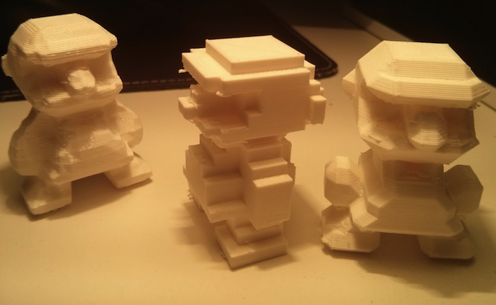

# ndarray-stl

Converts an [ndarray](https://github.com/mikolalysenko/ndarray) of voxels into an ascii [STL](http://orion.math.iastate.edu/burkardt/data/stl/stl.html) file suitable for 3D printing or other 3D applications.

You can also smooth the voxel volumes using various [isosurface smoothing algorithms](http://0fps.wordpress.com/2012/07/12/smooth-voxel-terrain-part-2/) such as marching cubes or surface nets.

STL files don't support color data, sorry.

[](https://npmjs.org/ndarray-stl)

```
npm install ndarray-stl
```

## How it works

This will work with any voxel data, but I built it to work with another app I made called [Voxel Builder](http://voxelbuilder.com). One of the users of DIY.org named burgzt made a [sweet mario](https://diy.org/burgzt/001em5) using it:


When you export your creation from Voxel Builder you get a PNG file with the voxel data magically encoded inside. That means you can upload the PNG photo of your creation into any app that knows how to extract it (such as the WebGl powered [voxel-critter](http://shama.github.io/voxel-critter/)) and you can then fully view edit your 3D in that app.

For example, this image has encoded voxel data hidden inside:


In the [ndarray-stl demo](http://maxogden.github.io/ndarray-stl/?png=http://i.imgur.com/ccBkMVY.png) I load the mario image (or any PNG url, you can specify one in the address bar), read the voxel data from the PNG and then generate an STL file from the voxels using ndarray-stl. You can also generate a smoothed voxel model. STL files can then be loaded into programs like MakerWare and 3D printed!


The above shows three STL files loaded into MakerWare: unsmoothed, smoothed with [surface nets](http://www.merl.com/papers/docs/TR99-24.pdf) and smoothed with [marching cubes](https://en.wikipedia.org/wiki/Marching_cubes).



Here are the 3 variations of Mario printed out by @vladikoff at the Mozilla San Francisco office. You can view more photos from his print [here](https://plus.google.com/106106671604413824025/posts/XRf6xttuUFT). Thanks, Vlad!

At this point in time there are over [400 creations](http://derekr.github.io/voxel-painter-admin/) that have been made with Voxel Builder. Any of them can be loaded into the ndarray-stl demo. Here are some good ones:

- [elephant](http://maxogden.github.io/ndarray-stl/?png=http://i.imgur.com/XawptQv.png)
- [outrigger boat](http://maxogden.github.io/ndarray-stl/?png=http://i.imgur.com/Gv5Q3UP.png)
- [race car](http://maxogden.github.io/ndarray-stl/?png=http://i.imgur.com/ZcSVaqy.png)

## api

see `demo.js` for example usage

### var stl = require('ndarray-stl')

require the module

### stl(voxels, options)

`voxels` has to be a 3d ndarray. returns an ascii stl string.

`options` an object with these defaults:

```js
{
  "smooth": false,
  "method": "surfaceNets",
  "faceFormat": false
}
```

You can set `smooth` to true and pick a smoothing `method`, available methods are `surfaceNets`, `marchingCubes` or `marchingTetrahedra`.

To change the face format that gets serialized into the STL you can specify a `faceFormat`, e.g.:

```js
function (f) {
  var backwardsWindedFaceVertices = [f[2], f[1], f[0]]
  return backwardsWindedFaceVertices.map(function rotateVertices(v) {
    return [v[0], -v[2], v[1]]
  })
}
```

## license

BSD
